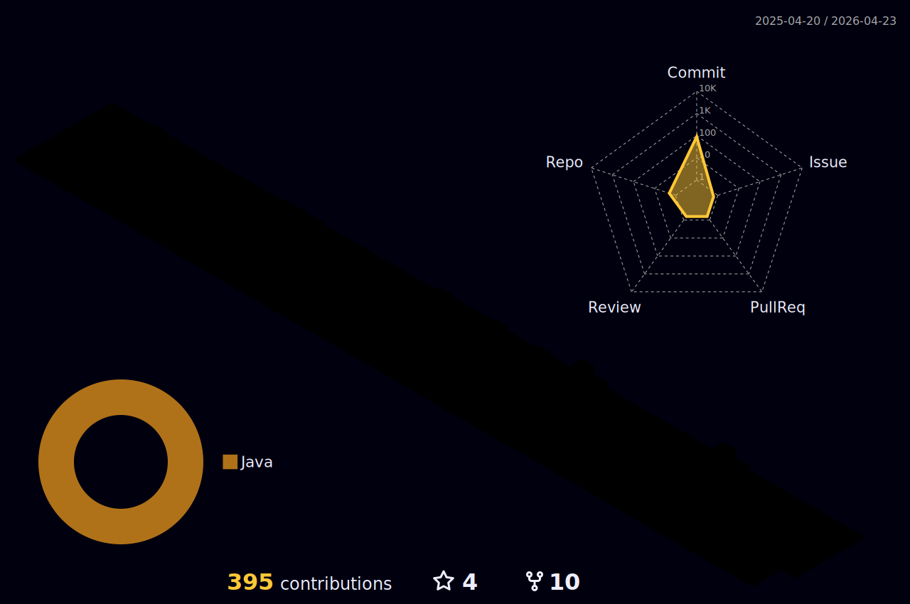

<h3 align="center">
  안녕하세요! 서버 개발자 전준익 입니다.
</h3>

<h3 align="center">
  Spring Boot 와 JPA 를 주로 사용하고 있으며, AWS 에 관심이 많습니다!
</h3>

## Skills 
Category|Stack
:---:|---
Backend|     
DevOps|       
AWS|        
Collaboration|      
Tool |    
Recent Interests|   

## Stats

